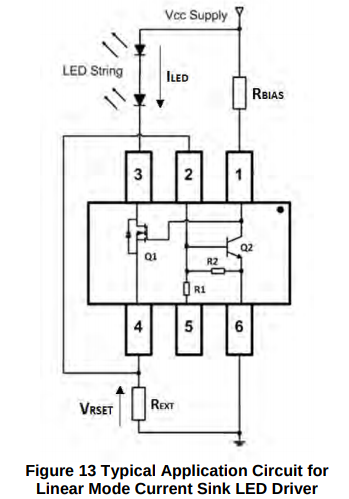

# OLED PMIC

Power Management IC OLED Driver Board

Using the [AL5801](https://www.digikey.com/product-detail/en/diodes-incorporated/AL5801W6-7/AL5801W6-7DICT-ND/3481118), we can supply a high voltage (9V) to the OLEDs while controlling the current through it, up to 350mA. To limit the current through Q2 (see figure below) R\_bias must be set to 52.5k when running Vcc = 9V. The sense resistor R\_ext will be set to a minimum of 1.6 Ohms for full 350mA operation.

